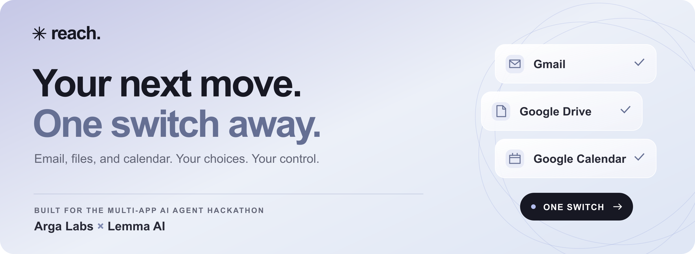

# Reach

**Your next move. One switch away.**

**[Watch the demo · 1:31](https://youtu.be/iDmX2GvqIyg)** · **[Visit the live homepage](https://reach-lilac-mu.vercel.app/#home)** · [Try the practice workspace](https://reach-lilac-mu.vercel.app/#app)

Reach helps someone prepare a reply across **Gmail, Google Drive and Google Calendar** using a switch mapped to the Space key. The person chooses the response, attachment, time and wording. Reach gathers the context, prepares the steps and verifies the results.

Built for the Multi-App AI Agent Hackathon. Reach is a working prototype deployed on Vercel, with a real Anthropic planner, live Google integrations and separately tested Arga service twins.

## What it does

1. Reads a configured request and gathers portfolio PDFs and available calendar slots.
2. Proposes a supported task: share a portfolio, propose a 30-minute meeting, or both.
3. Lets the user select resources and revise the reply’s tone through large, scanned choices.
4. Presents the exact recipient, reply, attachment and private hold for approval.
5. Rechecks the apps before writing, creates an **unsent draft** and optional **private hold with no guests**, then reads both back.

If the selected time becomes unavailable, Reach preserves the wording and attachment, asks for a replacement time and requires a new approval. Interrupted writes are journaled before execution; recovery verifies existing results before considering any remaining action.

There is no send-mail endpoint. Reach does not share Drive files, invite meeting guests or assume that the other person is available.

## Try it locally — no accounts or API keys required

Use Node.js 24 and npm. The hosted runtime and Blob SDK are configured for this version.

```sh
git clone https://github.com/Pavilion-devs/reach.git
cd reach
npm ci
npm start
```

Open the [landing page](http://127.0.0.1:4317/#home) or [workspace](http://127.0.0.1:4317/#app). A clean checkout defaults to **Practice mode**: fictional data, deterministic template wording and simulated app actions. No external service or model is called.

- Press **Space** to start scanning; press it again to select the highlighted choice.
- Controls support 1.5, 2.5, 4 or 6 seconds per choice and optional spoken labels.
- Pause and controls are reachable through the scan. **Escape** pauses scanning.
- Standard **Tab/Enter** and pointer input also work. Switching browser tabs pauses the scan.

To force practice mode when a local `.env` already configures Google:

```sh
REACH_PROVIDER=demo npm start
```

Practice failure scenarios are available at `/?scenario=calendar-changed#app`, `/?scenario=file-changed#app`, `/?scenario=gmail-fails#app` and `/?scenario=readback-fails#app`. These are simulations, not Arga runs.

## Connect Google and Anthropic

Use a dedicated Google test account. Setup creates fictional test resources in that account; it is not a read-only operation.

1. In your Google Cloud project, enable the Gmail, Google Drive and Google Calendar APIs. Configure the OAuth consent screen and add your test account if the app is in testing mode.
2. Create a **Web application** OAuth client with this authorized redirect URI: `http://127.0.0.1:4317/auth/callback`. Download its client JSON outside the repository.
3. Prepare the local configuration and import that client:

   ```sh
   cp .env.example .env
   chmod 600 .env
   node configure-google.mjs /absolute/path/to/downloaded-client.json
   ```

4. In the ignored `.env`, set `ANTHROPIC_API_KEY` and a model available to your account. The tested model is `claude-sonnet-5`. Set `ANTHROPIC_WORKSPACE_ID` if your key requires it. Alternatively, put those Anthropic settings in an ignored `.anthropic.env` with file mode `600`. Never put credentials in frontend files.
5. Start or restart the server. Open `http://127.0.0.1:4317/auth/google` and complete Google consent yourself.
6. With `REACH_AUTO_SETUP=true` (the example default), Reach creates a dedicated folder, two PDF fixtures and a clearly labelled fictional request draft, then configures future meeting candidates. The setup journal prevents blindly repeating uncertain creates.
7. Reload the workspace. The badge should say **Google test account**. Google mode uses the Anthropic planner; missing model credentials produce an explicit error.

The fixture request is an **unsent setup draft**, not a message received from a real client. Your reviewed result remains another unsent draft.

For existing test resources, use `REACH_AUTO_SETUP=false`, set `REACH_PROVIDER=google`, and configure `REACH_MESSAGE_ID`, `REACH_DRIVE_FOLDER_ID`, `REACH_CALENDAR_ID`, `REACH_TIMEZONE` and comma-separated future ISO timestamps in `REACH_SLOT_STARTS`. Slots last 30 minutes. Refresh these candidates when they run out. An existing `GOOGLE_REFRESH_TOKEN` can replace the initial browser connection.

The granted Google scopes cover Gmail read/compose, Drive read/app-created files and Calendar events. Google credentials remain on the server. Anthropic receives the request, PDF metadata and candidate slots for interpretation; it does not receive Google credentials or PDF contents. The model has no provider-write tools.

## Architecture

```text
Single-switch / keyboard / pointer UI
                  │ choices + screen revision
                  ▼
             Reach engine ◄── Anthropic structured proposals
                  │
       checked plan + explicit approval
                  │
          durable local action journal
                  │
         Google or Arga provider adapter
                  │
         Gmail · Drive · Calendar
                  │
          verified readback receipts
```

The frontend renders choices and sends their IDs. The engine owns task stages, validation, approval and execution. Exact recipient, attachment and meeting details come from selected resources, not generated write commands. See [API_CONTRACT.md](API_CONTRACT.md).

## Reliability and evaluation

| Evidence | Verified result |
| --- | --- |
| Backend regression suite | **48 tests passed** on September 13, 2026 |
| Live Anthropic evaluation | Six cases passed: combined task, portfolio only, meeting only, unsupported payment, unsupported duration and injected instructions |
| Finished UI + real Google + real Sonnet | Space-key task selections completed request → tone revision → calendar conflict → targeted repair → approved execution → three verified receipts |
| Restart | The completed live task and its receipts survived a server restart and browser reload |
| Arga Gmail | Draft/body/PDF readback, unique-marker discovery, one matching draft and zero sent messages |
| Arga Drive and Calendar | Separately verified downloadable PDFs and a private hold without guests |

See the [validation summary](docs/VALIDATION.md) for scope and limitations. Raw live-service reports contain account-linked IDs and task content and are deliberately excluded from Git. Verification scripts are included so checks can be reproduced with your own test resources.

```sh
npm run check
npm test
```

The backend tests require no external credentials or model calls. They cover stale and forged choices, concurrent approval, partial writes, incorrect readbacks, disk failure, abrupt process exit, recovery, resource changes and explicit request constraints.

Optional browser regression suite:

```sh
npx playwright install chromium --only-shell
npm run test:browser
```

This launches an isolated **practice** server on port 4318 and refuses to reuse an existing server. Browser test sources are included; the latest integrated browser verification was performed separately in Codex’s browser. Generated outputs stay local.

`node eval-anthropic.mjs` makes billable model calls using local credentials and simulated providers. The live Google verification scripts create test drafts/holds and retain journals; inspect them before running, and do not remove a journal simply to bypass a duplicate-write guard.

## Arga integration

Install and authenticate the [official Arga CLI](https://docs.argalabs.com/cli-and-mcp). Python 3 is needed for the provisioning helper.

```sh
arga login
npm run arga:provision -- --twins gmail
npm run arga:status
# Wait until the run reports ready, then:
npm run arga:verify
npm run arga:teardown
```

Repeat with `google_drive` or `google_calendar` for the other single-provider checks. The helper requests a private 10-minute environment with fictional data. Local manifests contain twin credentials and are ignored by Git.

The account used for development allowed one twin per run. A simultaneous three-twin provisioning attempt was rejected; **separate service checks are not proof of a complete multi-app Arga run**. If your entitlement allows it, `npm run arga:provision -- --twins all` requests all three. The included single-twin verifier deliberately rejects a multi-twin run. A complete Arga-backed UI run requires all three seeded services, their actual IDs configured in `.env`, `REACH_PROVIDER=arga` and Anthropic credentials.

The Arga adapter rejects expired environments and recognized stub responses, and cannot fall back to real Google token refresh or uploads. The reusable contribution is a user-controlled workflow with explicit approval, verifiable outcomes and failure cases that can be exercised against service twins. No Lemma integration is implemented.

## Current limits and deployment

- Supported actions are portfolio sharing, proposing a 30-minute meeting, or both. This is not an unrestricted assistant.
- Deterministic checks cover explicit numeric durations, ISO dates and latest-file selection; they do not comprehensively parse every natural-language condition.
- Google writes are not transactional. Another calendar event can arrive after the availability check.
- Recovery can discover a draft by its unique marker and verify it. Missing, ambiguous or incomplete discovery never authorizes a repeat POST. A verified hold can continue to a never-attempted draft only after explicit approval and fresh checks; changed context stops that continuation.
- Local task journals are owner-only plaintext files. Hosted task journals use private Vercel Blob storage. Google recovery requires the same connection, port and browser session cookie. There is no task-list UI or cookie-loss recovery. Demo app state is in memory; Arga tasks cannot resume across twin runs.
- Switch/keyboard browser checks do not establish accessibility conformance. Testing with people who use alternative access is still needed.
- **Deployed on Vercel:** public practice mode and an owner-authenticated live Google workspace, backed by private Blob journals and conditional writes. This is an owner-operated test deployment, not a multi-user OAuth service. See [deployment instructions and verification](docs/DEPLOYMENT.md). Local `npm start` still runs the loopback server.

## Demo video

**[Watch the 1:31 demo on YouTube](https://youtu.be/iDmX2GvqIyg)**

The demo follows a real Google test-account workflow: select a portfolio PDF and meeting time with the Space key, review the reply, recover from a deliberately introduced calendar conflict, and verify an unsent Gmail draft and a private calendar hold. It also summarizes the backend tests and separate Arga service checks. Footage is edited for pacing.

Visit the [live Reach homepage](https://reach-lilac-mu.vercel.app/#home) or [open the public practice workspace](https://reach-lilac-mu.vercel.app/#app). Public practice mode uses simulated actions; the video shows the connected Google test account. The [demo runbook](DEMO_RUNBOOK.md) documents the workflow.

## Repository contents

- `public/`: landing page, workspace, switch controls and labelled synthetic previews.
- `src/`, `server.mjs`: planner, engine, providers, setup and durable task store.
- `tests/`: reproducible regression tests.
- `fixtures/`: fictional UI examples; regenerate with `node generate-ui-fixtures.mjs`.
- Root verification scripts: optional live model, Google and Arga checks.

Credentials, local account notes, task journals, downloaded OAuth clients, dependencies, generated reports, screenshots, build outputs and deployment-local state are ignored. Tests and verification source remain tracked because they explain how the project is evaluated.
